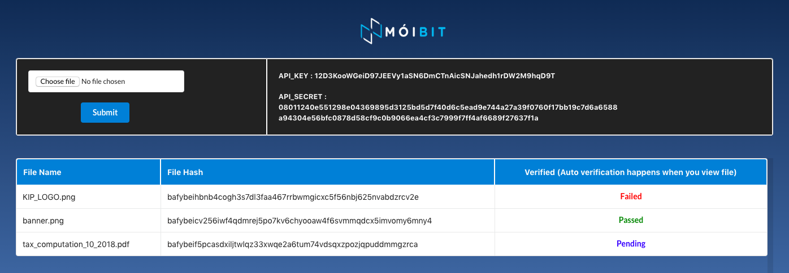
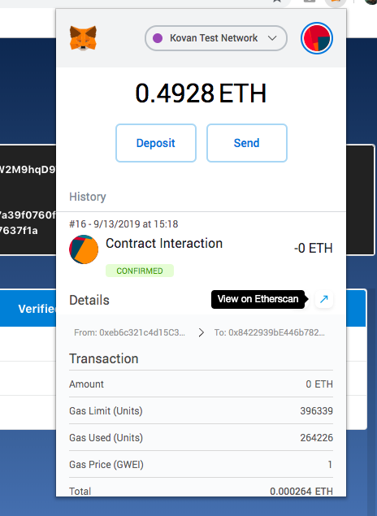
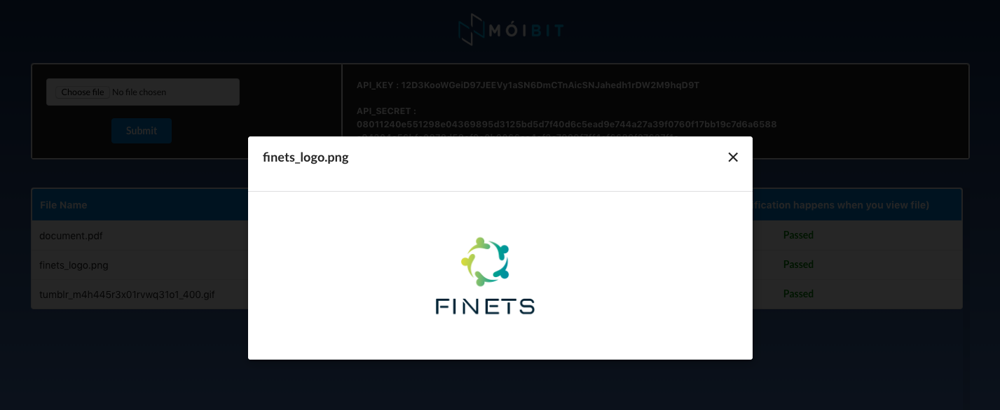
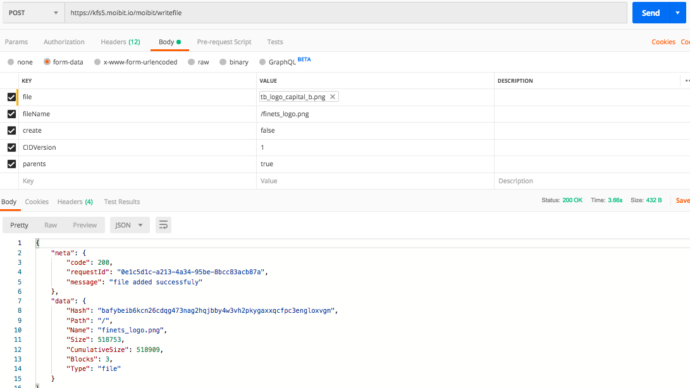
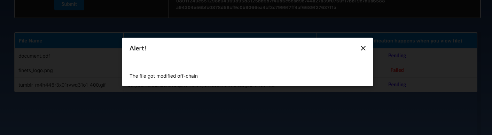

# MoiBit Sample DApp

[](https://join.slack.com/t/moibit/signup)
[](https://t.me/moibit)
[](https://twitter.com/moibitio)

A sample decentralized application that uses **MoiBit API** as a storage platform for off-chain storage.

## What does the dApp do?

It allows the **Authenticated MoiBit** users to upload their files to MoiBit and store the corresponding Multihash of the files on Ethereum for provenance.  
It also allows users to view and list their files. All these features are enabled using the MoiBit API platform alongside authentication.

> Click [here](https://account.moibit.io) to create your Moibit account.  


> **IMPORTANT NOTE:** Once you create and verify your MoiBit account, be sure to update the /src/middleware/credentials.js file with your proper credentials for the sample DApp to work.

## Tech Stack Involved

- React    - Front end library
- Solidity - The language used to build smart contracts that run on Ethereum
- MoiBit  - A decentralized storage network with reliable infrastructure and APIs

### Let’s Get Started!

>_Make sure you already have the Metamask downloaded. If not, download it from  [here](https://metamask.io/)._

#### Install the following dependencies:
[Create React App](https://github.com/facebookincubator/create-react-app) is an intuitive package and is the best way to start building a new  [single page](https://reactjs.org/docs/glossary.html#single-page-application)  application in React.

``` bash
npx create-react-app beta-sample-dapp
cd beta-sample-dapp
npm install web3 --save #middleware to interact with ethereum
npm install semantic-ui-react --save #front-end development framework
npm install axios --save #promise based http client
npm install filesaver --save #enable us to download files
```

#### Deploy the Smart Contract on Kovan Testnet

>_Make sure you’re on the Kovan testnet on metamask._

To deploy the smart contract you need ether(s). To get ethers for the kovan testnet visit [https://faucet.kovan.network](https://faucet.kovan.network)

To deploy the smart contract go to  [https://remix.ethereum.org](https://remix.ethereum.org/). Please add _Deploy & Run Transactions_  and _Solidity Compiler_ plugins if you haven't yet.

paste the following codes in **_/src/middleware/sampleBetaAppContract.js_**

``` js
pragma solidity ^0.5.5;
pragma experimental ABIEncoderV2;

contract SampleBetaAppContract {

    struct File {
      string fileName;
      string fileHash;
    }
    
    // mapping of user address to their list of files
    mapping(address => File[]) public user_files;
    mapping (string => string) public file2Hashes; 
    File[] public allFiles;
    
    // Appending the new hash to user's list of hashes
    function setHash(string memory _fileName, string memory _fileHash) public returns (bool setBool){
        File memory file = File(_fileName, _fileHash);
        user_files[msg.sender].push(file);
        file2Hashes[_fileName] = _fileHash;
        allFiles.push(file);
        return true;
    }

    // Lists all the hashes of the user's files
    function getList() public view returns (File[] memory retFiles) {
        return user_files[msg.sender];
    }

    // Lists all the hashes of the files independent of the user
    function listAllHashes() public view returns (File[] memory retFiles) {
        return allFiles;
    }
    
    // Lists all the hashes of the files independent of the user
    function getHashByName(string memory _fileName) public view returns (string memory _fileHash) {
        return file2Hashes[_fileName];
    }
}
```


Save the address of the smart contract. For this dApp it is: ```0xdBa8EC446B8fa878EE6d0d0C4A73995Ac7486706```

Also, save the Application Binary Interface (ABI) in JSON. It can be found under solidity complier plugin
For this dApp it is:

``` json
[ { "constant": false, "inputs": [ { "name": "_fileName", "type": "string" }, { "name": "_fileHash", "type": "string" } ], "name": "setHash", "outputs": [ { "name": "setBool", "type": "bool" } ], "payable": false, "stateMutability": "nonpayable", "type": "function" }, { "constant": true, "inputs": [ { "name": "", "type": "uint256" } ], "name": "allFiles", "outputs": [ { "name": "fileName", "type": "string" }, { "name": "fileHash", "type": "string" } ], "payable": false, "stateMutability": "view", "type": "function" }, { "constant": true, "inputs": [ { "name": "", "type": "string" } ], "name": "file2Hashes", "outputs": [ { "name": "", "type": "string" } ], "payable": false, "stateMutability": "view", "type": "function" }, { "constant": true, "inputs": [ { "name": "_fileName", "type": "string" } ], "name": "getHashByName", "outputs": [ { "name": "_fileHash", "type": "string" } ], "payable": false, "stateMutability": "view", "type": "function" }, { "constant": true, "inputs": [], "name": "getList", "outputs": [ { "components": [ { "name": "fileName", "type": "string" }, { "name": "fileHash", "type": "string" } ], "name": "retFiles", "type": "tuple[]" } ], "payable": false, "stateMutability": "view", "type": "function" }, { "constant": true, "inputs": [], "name": "listAllHashes", "outputs": [ { "components": [ { "name": "fileName", "type": "string" }, { "name": "fileHash", "type": "string" } ], "name": "retFiles", "type": "tuple[]" } ], "payable": false, "stateMutability": "view", "type": "function" }, { "constant": true, "inputs": [ { "name": "", "type": "address" }, { "name": "", "type": "uint256" } ], "name": "user_files", "outputs": [ { "name": "fileName", "type": "string" }, { "name": "fileHash", "type": "string" } ], "payable": false, "stateMutability": "view", "type": "function" } ]
```

In the **_/src/middleware/web3.js_** 
``` js
import BetaAPI from './SampleBetaApp.json';
import Web3 from 'web3';
var web3;
  if (window.ethereum) {
      web3 = new Web3(window.ethereum);
      try {
          // Request account access if needed
          window.ethereum.enable()
          .then(console.log('Acccounts now exposed'))
          .catch(error => console.log(error));
      } catch (error) {
          console.log(error.message);
      }
  }
  else if(typeof window !== 'undefined' && typeof window.web3 !== 'undefined'){
      web3 = new Web3(window.web3.currentProvider);
  }
  const instance = new web3.eth.Contract(
    BetaAPI,
     '0xdBa8EC446B8fa878EE6d0d0C4A73995Ac7486706'
  );
  export default {Config : instance,web3 : web3}
```

The above code helps to connect with the contract deployed and make use of the function
>_To make it simple we are going to use first address in metamask as **Admin** and remaining addresses as his/her users._

in file **_/src/middleware/credentials.js_**
``` js
//You need to update each credentials as displayed on your moibit api dashboard.

export default {
    "API_KEY": "", //YOUR API KEY
    "API_SECRET": "", //YOUR API SECRET
    "ADMIN": "", // ANY ACCOUNT OF YOUR WISH
    "CUSTOM_URL" : "" //URL YOU HAVE BEEN ASSIGNED TO
}
```
in **_/src/container/dapp.js_**
``` js
import  React, { Component } from  'react';
import  Layout  from  '../component/layout.js';
class  Dapp  extends  Component {
	render() {
		return (<Layout  />);
	}
}	
export  default  Dapp;
```
The above code will render the layout below which helps to explore all routes of MoiBit.



#### Let's go into the details
in **_src/component/tableList_**
``` js
import React from 'react';
import { Table,Icon } from 'semantic-ui-react';
import '../App.css';
class TableList extends React.Component {
    state = {
        props1 : this.props
    }
    componentWillReceiveProps(newProps) {
        this.setState({props1 : newProps});
    }
    render() {
        const custom_primary = {
            backgroundColor: '#2185d0',
            color: '#fbfbfb',
            border: '1px solid #fbfbfb'
        }
        return (
            <Table celled >
                <Table.Header >
                    <Table.Row>
                        <Table.HeaderCell style={custom_primary}>
                            File Name
                                        </Table.HeaderCell>
                        <Table.HeaderCell colSpan='2' style={custom_primary}>
                            File Hash
                                        </Table.HeaderCell>
                        <Table.HeaderCell textAlign="center" style={custom_primary}>
                            Verified (Auto verification happens when you view file)
                                        </Table.HeaderCell>
                    </Table.Row>
                </Table.Header>
                <Table.Body>
                    {this.state.props1.fileList.length == 0 ? 
                        <Table.Row>
                            <Table.Cell />
                            <Table.Cell colSpan='2' textAlign="center">
                              No Data
                            </Table.Cell>
                            <Table.Cell />
                        </Table.Row> :
                        this.state.props1.fileList.map(aFile =>
                        <Table.Row key={aFile.fileName}>
                            <Table.Cell onClick={() => this.state.props1.readFile(aFile.Hash,aFile.Name) } className="hashHover">
                                {aFile.Name}
                            </Table.Cell>
                            <Table.Cell colSpan='2'>
                              <p>  {aFile.Hash}</p>
                            </Table.Cell>
    
                            <Table.Cell textAlign="center">
                                {aFile.verfiledBoolean == 0 ? 
                                    <h5 style={{color:'blue'}}>Unverified</h5> : 
                                    aFile.verfiledBoolean == 1 ? 
                                    <h5 style={{color:'green'}}>Passed</h5> : 
                                    aFile.verfiledBoolean == -1 ? 
                                    <h5 style={{color:'red'}}>Failed</h5> :
                                    <Icon loading name='spinner' size="large" />
                                }
                            </Table.Cell>
    
                        </Table.Row>
                    )}
    
    
                </Table.Body>
            </Table>
        );
    }   
}
export default TableList;
```
this is a re-usable component for rendering the list of files in table format

in **/src/component/layout.js**
``` js
import React, { Component } from 'react';
import '../App.css';
import { Image, Table, Button, Input, Form } from 'semantic-ui-react';
import MoiBit from '../moibit_logo_transparent.png';
import TableList from './tableList';
import credentials from '../middleware/credentials';
import Instance from '../middleware/web3';
import axios from 'axios';
import ShowModal from './modal';
class Layout extends Component {
    state = {
        fileList: [],
        file: '',
        accountId: '',
        loading: false,
        fieldReq: false,
        readFileIframe: '',
        fileType: '',
        modalOpen: false,
        fileName: '',
    }
    /* Load loggedIn account and render view respectively */
    async componentDidMount() {
        let acc = await Instance.web3.eth.getAccounts();
        this.setState({ accountId: acc[0] });
        this.observe();
        axios.defaults.headers.common['api_key'] = credentials.API_KEY;
        axios.defaults.headers.common['api_secret'] = credentials.API_SECRET;

        if (acc[0] === credentials.ADMIN) {
            this.getALLHashes();
        }
        else {
            this.getFileHash();
        }
    }

    /* Get all files of users but not customers */
    getFileHash = async () => {
        let data = await Instance.Config.methods.getList().call({ from: this.state.accountId });
        let actual = [];
        if(data.length !== 0) {
            for (let i = 0; i < data.length; i++) {
                actual.push({
                        Name :  data[i].fileName.split("/")[1],
                        Hash :  data[i].fileHash,
                        verfiledBoolean : 0
                    });
            }
        }
        this.setState({ fileList: actual });
    }

    /* Executing list files from MoiBit API */
    getALLHashes = async () => {
        let response = await axios({
            method: 'post',
            url: credentials.CUSTOM_URL+"/moibit/listfiles",
            data: { path: "/" }
        });
        let data = [];
        if(response.data.data.Entries !== null) {
            for (let i = 0; i < response.data.data.Entries.length; i++) {
                if (response.data.data.Entries[i].Type === 0) {
                    await data.push({
                        Name :  response.data.data.Entries[i].Name,
                        Hash :  response.data.data.Entries[i].Hash,
                        verfiledBoolean : 0
                    });
                }
            }
        }
        this.setState({ fileList: data });
    }
    handleSubmit = async (e) => {
        e.preventDefault();
        if (this.state.file !== "") {
            let formData = new FormData();
            formData.append('file', this.state.file);
            formData.append('fileName', '/' + this.state.file.name);
            this.setState({ loading: true });

            let response = await axios({
                method: 'post',
                url: credentials.CUSTOM_URL+"/moibit/writefile",
                data: formData
            });
            const actualFileName = credentials.API_KEY + "" + response.data.data.Path + "" + response.data.data.Name;
            await Instance.Config.methods.setHash(actualFileName, response.data.data.Hash).send({ from: this.state.accountId });
            if (this.state.accountId === credentials.ADMIN) {
                this.getALLHashes();
                this.setState({ loading: false });
            }
            else {
                this.getFileHash();
                this.setState({ loading: false });
            }
            this.setState({ loading: false });
        }
        else {
            this.setState({ fieldReq: true })
        }
    }

    observe = async () => {
        try {
            setTimeout(this.observe, 1000);
            const accounts = await Instance.web3.eth.getAccounts();
            if (accounts[0] === this.state.accountId) {

            }
            else {
                window.location = "/";
            }
            return;
        }
        catch (error) {
            console.log(error.message);
        }
    }

    /* Comparing hash of off-chain aganist on-chain hash */
    checkForProvenence = async (name,hash) => {
        let response = await axios({
            method: 'post',
            url: credentials.CUSTOM_URL+"/moibit/listfiles",
            data: { path: "/" }
        });

        let allFiles = response.data.data.Entries;
        const index1 = allFiles.map(e => e.Name).indexOf(name);
        let checkingHash = '';
        if(index1 != -1) {
            checkingHash = allFiles[index1].Hash;
        }
        

        let successs = true;
        let files = this.state.fileList;
        const index = files.map(e => e.Name).indexOf(name);
        if(files[index].verfiledBoolean === 0) {
            files[index] = {
                Name :  name,
                Hash :  hash,
                verfiledBoolean : 2
            }
            this.setState({fileList : files});

            /* we are rendering all the root files so we are adding / in prefix to file name */
            const filename = credentials.API_KEY+'/'+name; 
            if(checkingHash == await Instance.Config.methods.getHashByName(filename).call()) {
                files[index] = {
                    Name :  name,
                    Hash :  hash,
                    verfiledBoolean : 1
                }
                this.setState({fileList : files});
            }
            else {
                files[index] = {
                    Name :  name,
                    Hash :  hash,
                    verfiledBoolean : -1
                }
                this.setState({fileList : files});
                successs = false;
            }
            return successs;
        }
        else {
            return successs;
        }
    }

    readFile = async (filehash, fileName) => {
        if(await this.checkForProvenence(fileName,filehash)) {
            var responseType = '';
            if (fileName.substr(-3, 3) === "txt" || fileName.substr(-3, 3) === "csv" || fileName.substr(-3, 3) === "php" || fileName.substr(-3, 3) === "html" || fileName.substr(-2, 2) === "js") {
                responseType = '';
            }
            else {
                responseType = 'blob';
            }
            const url = credentials.CUSTOM_URL+'/moibit/readfilebyhash';
            axios({
                method: 'post',
                url: url,
                responseType: responseType,
                data: {
                    hash: filehash
                }
            })
            .then(response => {
                if (typeof (response.data) == "string") {
                    this.setState({ readFileIframe: response.data,
                        fileType: response.headers['content-type'],
                        fileName: fileName,
                        modalOpen: true
                    });
                }
                else {
                    this.setState({
                        readFileIframe: window.URL.createObjectURL(new Blob([response.data], {type:response.headers['content-type']})),
                        fileType: response.headers['content-type'],
                        fileName: fileName,
                        modalOpen: true 
                    })
                }
            })
            .catch(error => {
                console.log(error);
            });
        }
        else {
            this.setState({ readFileIframe: "The file got modified off-chain",
                            fileType: 'text/plain',
                            fileName: 'Alert!',
                            modalOpen: true
                        });
        }
    }
    modalClose = () => {
        this.setState({ modalOpen: false });
    }
    render() {
        const custom_header = {
            backgroundColor: '#222222',
            color: '#fbfbfb',
            border: '1px solid #fbfbfb'
        }
        return (
            <div className="layoutBG">
                {this.state.fileName !== '' ? <ShowModal modalOpen={this.state.modalOpen}
                    modalClose={this.modalClose}
                    fileType={this.state.fileType}
                    responseData={this.state.readFileIframe}
                    fileName={this.state.fileName}
                /> : null}
                <div style={{ display: 'flex', color: '#fbfbfb', marginLeft: '42vw' }}>
                    <Image src={MoiBit} height="60px" width="160px" />
                    {/* <h3 style={{ marginTop: '10px', fontSize: '26px' }}>MoiBit</h3> */}
                </div>
                <div className="table_body_scrollable">
                    <Form onSubmit={(event) => this.handleSubmit(event)} encType="multipart/form-data">
                        <Table celled size="small" style={{ marginTop: '20px', marginBottom: '40px', background: '#f2f2f2', color: '#222222' }}>
                            <Table.Header>
                                <Table.Row>

                                    <Table.HeaderCell style={custom_header}>
                                        <Table.Row>
                                            <Table.Cell textAlign="center" colSpan='2'>
                                                <Input type="file" onChange={(e) => {
                                                    this.setState({ file: e.target.files[0] });
                                                }} required name="file" style={this.state.fieldReq ? { border: '2px solid red', borderRadius: '5px' } : {}} />
                                            </Table.Cell>
                                        </Table.Row>
                                        <Table.Row>
                                            <Table.Cell colSpan='2' textAlign="center" >
                                                <Button primary type="submit" loading={this.state.loading} disabled={this.state.loading} >Submit</Button>
                                            </Table.Cell>
                                        </Table.Row>
                                    </Table.HeaderCell>

                                    <Table.HeaderCell style={custom_header}>
                                        <Table.Row>
                                            <Table.Cell colSpan='2'>
                                                API_KEY : {credentials.API_KEY}
                                            </Table.Cell>
                                        </Table.Row>
                                        <Table.Row>
                                            <Table.Cell colSpan='2'>
                                                <div style={{ wordWrap: 'break-word', width: '600px' }}>
                                                    API_SECRET : {credentials.API_SECRET}
                                                </div>
                                            </Table.Cell>
                                        </Table.Row>
                                    </Table.HeaderCell>
                                </Table.Row>
                            </Table.Header>
                        </Table>
                    </Form>
                    <div className="content-container">
                        <TableList fileList={this.state.fileList} readFile={this.readFile}
                        />

                    </div>
                </div>
            </div>
        );
    }
}
export default Layout;
```
>_**You have to send your API_KEY and API_SECRET in the headers with every route**_


on clicking submit the file will be added to MoiBit using the following route:

>_**YOUR_IP/moibit/writefile"**_ is a post call used to upload/add a file to your directory in MoiBit, which expects a **form data**
``` json
{
	file : <file_of_any_type>,
	fileName:<absoulte_path_of_the_file> // means if you want to add a file to folder called 'X', then fileName : 'X'+ '<file_name>',
}		
```
which will return back following response :  
``` json
{
    "meta": {
        "code": 200,
        "msg": "uploaded successfully"
    },
    "data": {
        "Hash": "bafybeietzxj4i4vtt6k63daqpr7gqhmxt33w3ne6gj45jbkqp4r34hpzye",
        "Path": "/12D3KooWRMeX36JkeQegC3cd6dGcAsMffCXUKxaktS278rBcy7dV",
        "Name": "1_profile.jpeg",
        "Size": 160746,
        "CumulativeSize": 160804,
        "Blocks": 1,
        "Type": "file"
    }
}
```
for provenance and utility we are storing the file hash into blockchain , where you have to confirm in the metamask popup for which we use the following code:
``` json
await Instance.Config.methods.setHash(<file_name>, <file_hash>).send({ from:  <logged_in_account> });
```

You can see the transaction in etherscan (as shown below)
>

| Open Metamask | View Etherscan |
|---------------|----------------|
|  |  |

> we are storing the filename as ```<API_KEY>/<file_name>``` since your api key is a root directory itself.

once the file is uploaded you can see the file listed in the image above. You can list the files using the following route:

>_**IP/moibit/listFiles**_ is a post call used to get the files from a folder, which expects JSON data with a single attribute ```{ path : <path> }```, if the path is '/' it will return all the files that were uploaded to the root path using your API_KEY and API_SECRET and return the following response:
	
``` json
  {
    "meta": {
        "code": 200,
        "msg": "list file successfully"
    },
    "data": {
        "Entries": [
            {
                "Hash": "bafybeietzxj4i4vtt6k63daqpr7gqhmxt33w3ne6gj45jbkqp4r34hpzye",
                "Name": "1_profile.jpeg",
                "Size": 160746,
                "Type": 0
            },
            {
                "Hash": "bafybeidyzu3ypc55uhev2qxmb4bztplzdxjoc4vevirqb64ab2njxan4rq",
                "Name": "404.png",
                "Size": 14462,
                "Type": 0
            },
            ...
	    ]
	}
}
```

A type of 1 is a file and a type of 0 is a folder
  
To see the file use the following route :
>_**IP/moibit/readfilebyhash**_ is a post call used to get the file from MoiBit , which expects **JSON data with single attribute** ```{ filename : <name_of_the_file> }```

> When viewing the file triggered we are validating the hash stored on-chain against the off-chain hash.  If the hashes matches the verified column will be *Passed*. If the hashes do not match the verified column value will be *Failed*.  If the file has not been clicked yet it will have a value of *Unverified*.

After successful verification the file will display if the file type is viewable or it will be downloaded.


#### if you change the file off-chain by following the process below



When you click the file the verification will fail because it was changed off-chain and the off-chain hash no longer matches the hash of the file saved on-chain.

| Verification | On Click |
|---------------|----------------|
|  |  |

## Maintainers

1. [Vuppala Sai Prashanth](https://github.com/its-VSP)
2. [Arunprakash](https://github.com/Arunprakash1414)

## Contributors

1. Ayush Gupta
2. Ganesh Prasad Kumble

## Support

If you need more clarifications, feel free to join our Telegram or Slack community channels. You can also write us an email at [hello@moibit.io](mailto:hello@moibit.io)

## License

[GNU General Public License v3.0](https://github.com/moibit/Moibit-Sample-DApp/blob/master/LICENSE)
